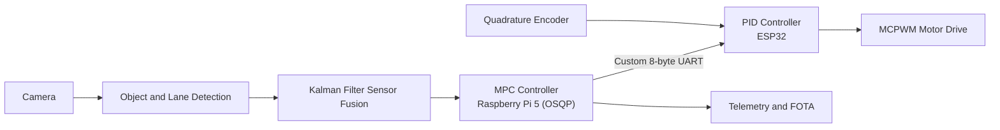

<!-- HEADER BANNER -->

  

  

  
  
  
  

  
  
  
  

---

## 👋 About Me

I am a fresh graduate **Embedded Systems Engineer** (Communication and Electronics Engineering, Helwan University, 2026) with 2+ years of hands-on work in firmware and R&D on **STM32, AVR and ESP32**. I build bare-metal drivers, real-time control loops and IoT systems, and I test them on real hardware.

| | |
|---|---|
| 🎯 **Fields** | Embedded Systems · Embedded Control Systems · Embedded IoT · Automotive Systems |
| 🏢 **Now** | Network and Light Current Engineer at Future Smart System, Cairo |
| 🚗 **Built** | AI-enhanced Adaptive Cruise Control (led a 4-member team) |
| 🎓 **Trained** | Embedded Linux (Yocto), AVR, IoT Diploma, AI (NTI), Wireless IoT (ITI) |
| ☕ **Fun fact** | My perfect day starts and ends with a cup of coffee |

---

## 🚀 Featured Project: AI-Enhanced Adaptive Cruise Control

A dual-layer embedded ACC system validated on real hardware and aligned with **ISO 15622:2018** and **ISO 26262:2018**.

<table>
  <tr>
    <td width="50%">

**🧠 Optimization layer (Raspberry Pi 5)**
- MPC model derived from first principles
- OSQP solver with hard safety constraints
- Object detection, lane detection, sensor fusion

    </td>
    <td width="50%">

**⚙️ Actuation layer (ESP32)**
- Tustin-discretized PID with anti-windup clamping
- MCPWM output with quadrature encoder feedback
- Modular C++ OOP driver library for sensors and control

    </td>
  </tr>
</table>

**Features:** automatic speed control · cut-in braking · lane curvature monitoring · remote telemetry · FOTA updates

🏆 Finalist graduation team, Made in Egypt (MIE) Competition 2026

---

## 🔧 More Projects

<table>

### ⚡ BLDC Sinusoidal PWM
STM32 Cortex-M4, Embedded C. SPWM drive with smoother torque and lower acoustic noise than trapezoidal control.

### 🔁 BLDC Trapezoidal PWM
STM32 Cortex-M3, Embedded C. 6-step commutation with reliable startup and stable operation under varying load.

### 🚙 Autonomous RC Car
AVR ATmega32, Embedded C. Obstacle avoidance with GPIO, timer-based ultrasonic sensing and PWM motor control. Verified in Proteus and on hardware.

### 📡 Multi-Directional Distance Detection
One MCU controlling multiple ultrasonic sensors with optimized processing and GPIO usage.

</table>

---

## 💼 Experience

### 🏢 Network and Light Current Engineer | Future Smart System (Aug 2026 to Present)
- Install and configure **Access Control Systems** and **CCTV Systems**
- Build networks on site: cabling, connections and device configuration
- Program **routers, switches and Raspberry Pi** to match client requirements
- Set up advertising screens connected to cameras
- Disassemble, repair and upgrade PCs and laptops, including part replacement

### 🤖 Robotics Coach | WiroPlus (Dec 2024 to Jan 2026)
- Delivered electronics and robotics curricula to **50+ students**, with 4+ hardware projects per semester
- Increased student engagement by **~25%** through project-based learning

### 🏎️ Electric and Embedded Systems Member | E-Rally (Oct 2024 to Sep 2025)
- Bare-metal STM32 firmware with PWM and GPIO drivers for an EV rally motor drive
- 6-step commutation, verified with oscilloscope measurements and signal tracing

### 🌐 R&D Volunteer and RAS Project Supervisor | IEEE Helwan (Sep 2023 to Sep 2025)
- Led firmware projects at IEEE events and mentored participants across Egypt
- Supervised student teams building firefighting robots and sensor automation in C and Arduino

<b>🏧 Earlier: ATM Maintenance Technician | Raya IT (Internships 2022 and 2023)</b>

- Maintained and repaired 20+ ATM machines, diagnosing board-level, component-level and firmware faults
- Trained and guided 5+ junior technicians during field operations

---

## 🛠 Tech Stack

  

| Area | Skills |
|------|--------|
| **Microcontrollers** | STM32 (Cortex-M3/M4) · AVR ATmega32 · ESP32 (ESP-IDF) · Arduino |
| **Firmware** | Bare-metal · HAL design · Peripheral drivers · Interrupts · Timers · ADC · PWM · FreeRTOS |
| **Embedded Linux** | Device drivers · Yocto · Linux system programming · Raspberry Pi 5 |
| **Protocols** | UART · SPI · I2C · MQTT · HTTP · Wi-Fi · Bluetooth |
| **Control** | BLDC control · PID · MPC (OSQP) · Power electronics |
| **Standards** | ISO 26262 · ISO 15622 |
| **Tools** | STM32CubeIDE · ESP-IDF · Proteus · MATLAB/Simulink · KiCad · Oscilloscope · Logic Analyzer |
| **Field skills** | Access Control · CCTV · Structured Cabling · Router and Switch Config · PC Hardware Repair |

---

## 🌱 Currently Learning

  
  
  
  
  

---

## 🏆 Awards

- 🥇 Finalist Graduation Team, Made in Egypt (MIE) Competition, Jul 2026
- 🏎️ Best Electric Sub-Team Member of the Month, E-Rally, Jul 2025
- 🌟 Best R&D Volunteer First Phase S'25, IEEE HSB, Oct 2024
- 🤖 2nd Place and Best Code, Sumo-Robot Competition, Dec 2023

---

## 📊 GitHub Stats

  
  

  

  

---

## 📫 Let's Work Together

Open to junior **embedded, firmware and automotive** roles. I am also available for network and light current projects.

  
  

  

